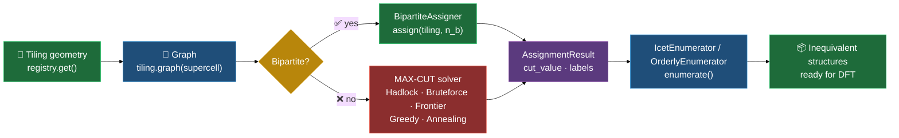

# archimono

[](LICENSE)
[](https://archimono.github.io/archimono/)
[](https://www.python.org/)

**archi**medean + ki**mono** (monolayer) — a Python toolkit for systematic
structure enumeration of 2D monolayer networks on all 11 Archimedean
tilings of the Euclidean plane.

Hexagonal boron nitride (h-BN) sits on the hexagonal (6³) tiling. `archimono`
asks: *what if you built the same kind of monolayer on the other ten?* It
builds the supercell graph, solves species assignment (optimally for
bipartite tilings, via MAX-CUT for frustrated ones), and reduces the
solution set to symmetry-inequivalent configurations.



## Install

```bash
git clone https://github.com/archimono/archimono
cd archimono
pip install -e ".[dev]"
```

## 30-second quickstart

```python
from archimono.tilings import registry
from archimono.assignment import BruteforceSolver, IcetEnumerator

tiling = registry.get("kagome")              # 3.6.3.6
graph  = tiling.graph(supercell=(2, 2))      # 12-node PBC graph

# Exact balanced MAX-CUT
result = BruteforceSolver().solve(graph, ["B", "N"], n_b=6)
# result.cut_value == 16.0, result.n_frustrated == 8

# Enumerate near-optimal symmetry-inequivalent structures
configs = IcetEnumerator().enumerate(
    tiling, n_b=6, supercell=(2, 2), min_cut=result.cut_value - 2
)
# len(configs) == 15
```

The full **API reference** is generated from the source docstrings and
published at <https://archimono.github.io/archimono/>.

## Documentation

The published documentation is an autogenerated **API reference**, built
from the source docstrings with [Sphinx](https://www.sphinx-doc.org), so it
stays faithful to the code. Browse it online at
<https://archimono.github.io/archimono/>.

Build it locally:

```bash
pip install -e ".[docs]"
sphinx-build -b html docs docs/_build/html
# then open docs/_build/html/index.html
```

## Development

```bash
ruff check src/      # lint
mypy src/            # type-check
pytest               # tests
```

See [CONTRIBUTING.md](CONTRIBUTING.md) to get started, and
[CLAUDE.md](CLAUDE.md) for the full dev contract (coding style, docstring
policy, citation requirements).

## Citation

If you use archimono in your research, please cite it. Machine-readable
metadata is in [`CITATION.cff`](CITATION.cff) (use GitHub's "Cite this
repository" button), or cite as:

> Ordillo, V., Castillo, V., Yamamoto, T., Harashima, Y., Takasuka, S.,
> Takayama, T., & Fujii, M. (2026). *archimono — A Python Toolkit for
> Systematic Structure Enumeration of 2D Monolayer Networks on Archimedean
> Tilings* (Version 0.1.0) [Computer software].
> https://github.com/archimono/archimono

```bibtex
@software{archimono2026,
  title   = {archimono - A Python Toolkit for Systematic Structure Enumeration of 2D Monolayer Networks on Archimedean Tilings},
  author  = {Ordillo, Viejay and Castillo, Virgil and Yamamoto, Tomiya and Harashima, Yosuke and Takasuka, Shogo and Takayama, Tomoaki and Fujii, Mikiya},
  year    = {2026},
  version = {0.1.0},
  url     = {https://github.com/archimono/archimono}
}
```
